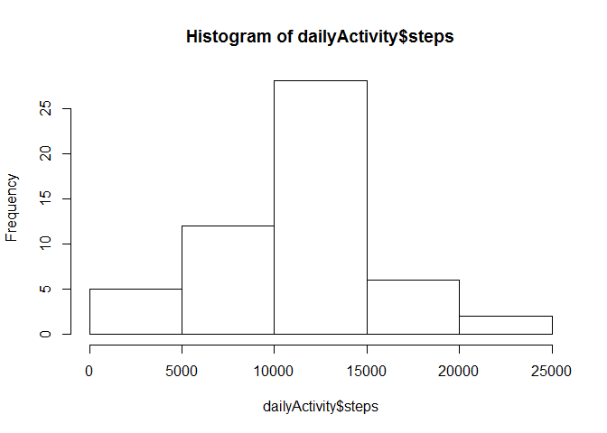
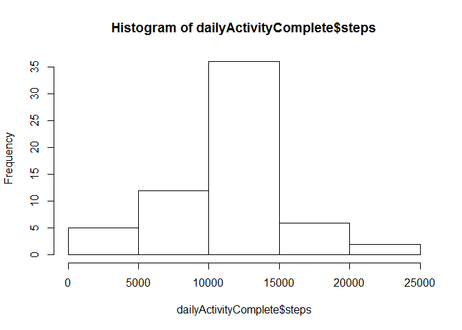
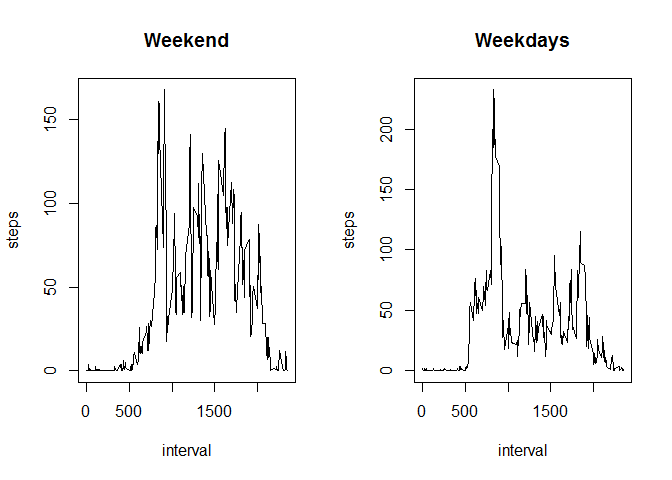

# Reproducible Research: Peer Assessment 1


## Loading and preprocessing the data


```r
unzip('activity.zip')
data <- read.csv('activity.csv', stringsAsFactors=FALSE)
data$date <- as.Date(data$date)
```

## What is mean total number of steps taken per day?


```r
dailyActivity <- aggregate(steps ~ date, data, sum)
hist(dailyActivity$steps)
```

 

```r
summary(dailyActivity$steps)
```

```
##    Min. 1st Qu.  Median    Mean 3rd Qu.    Max. 
##      41    8841   10760   10770   13290   21190
```

## What is the average daily activity pattern?


```r
intervalActivity <- aggregate(steps ~ interval, data, mean)
plot(intervalActivity, type='l')
```

 

```r
busiestInterval <- intervalActivity[intervalActivity$steps==max(intervalActivity$steps), ]$interval
print(sprintf('Busiest interval is %s', intervalActivity[intervalActivity$steps==max(intervalActivity$steps), ]$interval))
```

```
## [1] "Busiest interval is 835"
```


## Imputing missing values


```r
missingValues <- sum(is.na(data$steps))
print(sprintf('Missing values: %s', missingValues))
```

```
## [1] "Missing values: 2304"
```

```r
# will fill out the data with the mean of the interval +/- some random percentage
set.seed(100)
randVariation <- sample(-20:20, missingValues, replace=TRUE)

imputingData <- merge(data[is.na(data$steps),], intervalActivity, by.x='interval', by.y='interval')
imputingData$steps.x <- NULL
names(imputingData) <- c('interval', 'date', 'steps')
imputingData$steps <- imputingData$steps * (100+randVariation) / 100

# copy complete data
dataComplete <- data[!is.na(data$steps), ]
dataComplete <- rbind(dataComplete, imputingData)

# clean up
rm(list = c('imputingData', 'missingValues', 'randVariation'))

# create histogram and display summary
dailyActivityComplete <- aggregate(steps ~ date, dataComplete, sum)
hist(dailyActivityComplete$steps)
```

 

```r
summary(dailyActivityComplete$steps)
```

```
##    Min. 1st Qu.  Median    Mean 3rd Qu.    Max. 
##      41    9819   10800   10770   12810   21190
```

## Are there differences in activity patterns between weekdays and weekends?


```r
weekendFactor <- as.factor(weekdays(dataComplete$date) == 'Saturday' | weekdays(dataComplete$date) == 'Sunday')
dataComplete$weekend <- weekendFactor

par(mfcol = c(1,2))
plot(aggregate(steps ~ interval, dataComplete[dataComplete$weekend == TRUE, ], mean), type='l', main='Weekend')
plot(aggregate(steps ~ interval, dataComplete[dataComplete$weekend == FALSE, ], mean), type='l', main='Weekdays')
```

 
